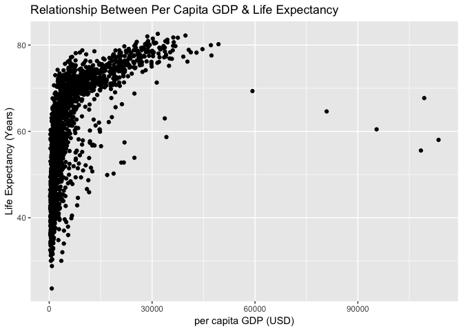
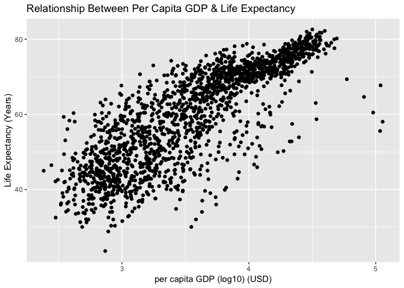
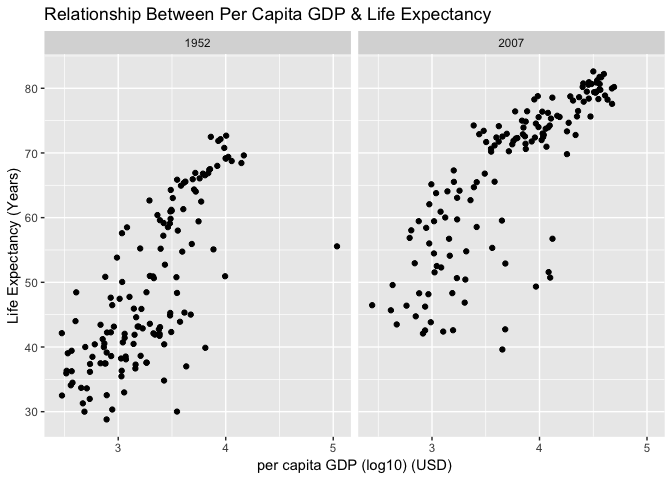
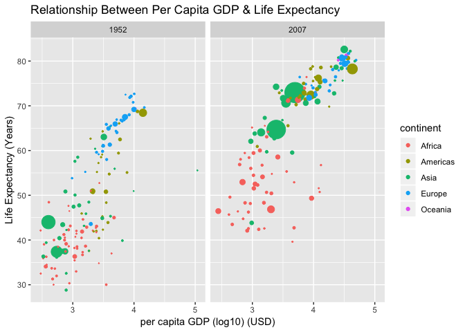
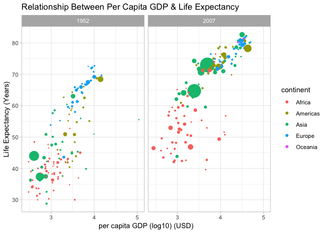
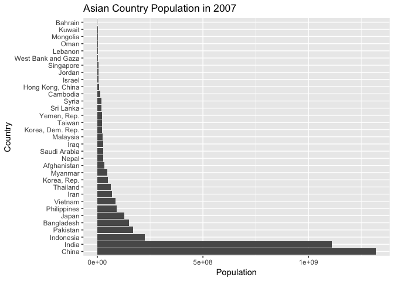
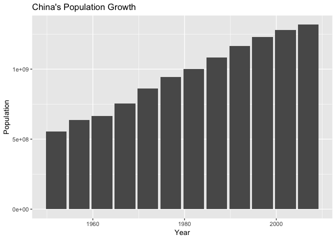
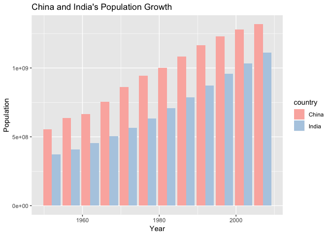

## Instructions
Answer the following questions and complete the exercises in RMarkdown. Please embed all of your code, keep track of your versions using git, and push your final work to our [GitHub repository](https://github.com/FRS417-DataScienceBiologists). I will randomly select a few examples of student work at the start of each session to use as examples so be sure that your code is working to the best of your ability.

## Load the libraries

```r
library(tidyverse)
library(skimr)
library("RColorBrewer")
```

## Resources
The idea for this assignment came from [Rebecca Barter's](http://www.rebeccabarter.com/blog/2017-11-17-ggplot2_tutorial/) ggplot tutorial so if you get lost go have a look. Please do not copy and paste her code!  

## Gapminder
For this assignment, we are going to use the dataset [gapminder](https://cran.r-project.org/web/packages/gapminder/index.html). Gapminder includes information about economics, population, and life expectancy from countries all over the world. You will need to install it before use.

```r
#install.packages("gapminder")
```


```r
library("gapminder")
```

Please load the data into a new object called gapminder.

```r
gapminder <- 
  gapminder::gapminder
```

1. Explore the data using the various function you have learned. Is it tidy, are there any NA's, what are its dimensions, what are the column names, etc.

Is it tidy:
Tidy. Because:
(1) each variable has its own column
(2) each observation has its own row
(3) each value has its own cell


NAs?    --> no NA

```r
skimr::skim(gapminder)
```

```
## Skim summary statistics
##  n obs: 1704 
##  n variables: 6 
## 
## ── Variable type:factor ─────────────────────────────────────────────────────────────────────────────
##   variable missing complete    n n_unique
##  continent       0     1704 1704        5
##    country       0     1704 1704      142
##                              top_counts ordered
##  Afr: 624, Asi: 396, Eur: 360, Ame: 300   FALSE
##      Afg: 12, Alb: 12, Alg: 12, Ang: 12   FALSE
## 
## ── Variable type:integer ────────────────────────────────────────────────────────────────────────────
##  variable missing complete    n    mean       sd    p0        p25     p50
##       pop       0     1704 1704 3e+07    1.1e+08 60011 2793664    7e+06  
##      year       0     1704 1704  1979.5 17.27     1952    1965.75  1979.5
##       p75       p100     hist
##  2e+07       1.3e+09 ▇▁▁▁▁▁▁▁
##   1993.25 2007       ▇▃▇▃▃▇▃▇
## 
## ── Variable type:numeric ────────────────────────────────────────────────────────────────────────────
##   variable missing complete    n    mean      sd     p0     p25     p50
##  gdpPercap       0     1704 1704 7215.33 9857.45 241.17 1202.06 3531.85
##    lifeExp       0     1704 1704   59.47   12.92  23.6    48.2    60.71
##      p75      p100     hist
##  9325.46 113523.13 ▇▁▁▁▁▁▁▁
##    70.85     82.6  ▁▂▅▅▅▅▇▃
```


Dimensions:

```r
dim(gapminder)
```

```
## [1] 1704    6
```


Column Names:

```r
names (gapminder)
```

```
## [1] "country"   "continent" "year"      "lifeExp"   "pop"       "gdpPercap"
```


2. We are interested in the relationship between per capita GDP and life expectancy; i.e. does having more money help you live longer on average. Make a quick plot below to visualize this relationship.

--> Positive relationship between per capita GDP and life expectancy. 

```r
gapminder %>% 
  ggplot(aes(x=gdpPercap, y=lifeExp))+
  geom_point()+
  labs(title = "Relationship Between Per Capita GDP & Life Expectancy",
       x= "per capita GDP (USD)",
       y= "Life Expectancy (Years)")
```

<!-- -->

  

3. There is extreme disparity in per capita GDP. Rescale the x axis to make this easier to interpret. How would you characterize the relationship?

--> Positive relationship between per capita GDP and life expectancy. 

```r
gapminder %>% 
  ggplot(aes(x=log10(gdpPercap), y=lifeExp))+
  geom_point()+
  labs(title = "Relationship Between Per Capita GDP & Life Expectancy",
       x= "per capita GDP (log10) (USD)",
       y= "Life Expectancy (Years)")
```

<!-- -->


4. This should look pretty dense to you with significant overplotting. Try using a faceting approach to break this relationship down by year.

--> Positive relationship between per capita GDP and life expectancy in all years.

```r
gapminder %>% 
  ggplot(aes(x=log10(gdpPercap), y=lifeExp))+
  geom_point()+
  labs(title = "Relationship Between Per Capita GDP & Life Expectancy",
       x= "per capita GDP (log10) (USD)",
       y= "Life Expectancy (Years)")+
  facet_wrap(~year)
```

<!-- -->


5. Simplify the comparison by comparing only 1952 and 2007. Can you come to any conclusions?

--> Positive relationship between per capita GDP and life expectancy. However, life expectancy increases as time progresses.

```r
gapminder %>% 
  filter(year == 1952 | year == 2007) %>% 
  ggplot(aes(x=log10(gdpPercap), y=lifeExp))+
  geom_point()+
  labs(title = "Relationship Between Per Capita GDP & Life Expectancy",
       x= "per capita GDP (log10) (USD)",
       y= "Life Expectancy (Years)")+
  facet_wrap(~year)
```

<!-- -->

6. Let's stick with the 1952 and 2007 comparison but make some aesthetic adjustments. First try to color by continent and adjust the size of the points by population. Add `+ scale_size(range = c(0.1, 10), guide = "none")` as a layer to clean things up a bit.


```r
gapminder %>% 
  filter(year == 1952 | year == 2007) %>% 
  ggplot(aes(x=log10(gdpPercap), y=lifeExp, color = continent, size = pop))+
  geom_point()+
  labs(title = "Relationship Between Per Capita GDP & Life Expectancy",
       x= "per capita GDP (log10) (USD)",
       y= "Life Expectancy (Years)")+
  facet_wrap(~year)+
  scale_size(range = c(0.1, 10), guide = "none")  #removes the size scale's legend
```

<!-- -->

7. Although we did not introduce them in lab, ggplot has a number of built-in themes that make things easier. I like the light theme for these data, but you can see lots of options. Apply one of these to your plot above.

```r
?theme_light
```


```r
gapminder %>% 
  filter(year == 1952 | year == 2007) %>% 
  ggplot(aes(x=log10(gdpPercap), y=lifeExp, color = continent, size = pop))+
  geom_point()+
  labs(title = "Relationship Between Per Capita GDP & Life Expectancy",
       x= "per capita GDP (log10) (USD)",
       y= "Life Expectancy (Years)")+
  facet_wrap(~year)+
  scale_size(range = c(0.1, 10), guide = "none") +  #removes the size scale's legend
  theme_light()
```

<!-- -->


8. What is the population for all countries on the Asian continent in 2007? Show this as a barplot.


```r
gmAsia <- gapminder %>%
  filter(year==2007, continent =="Asia")
gmAsia
```

```
## # A tibble: 33 x 6
##    country          continent  year lifeExp        pop gdpPercap
##    <fct>            <fct>     <int>   <dbl>      <int>     <dbl>
##  1 Afghanistan      Asia       2007    43.8   31889923      975.
##  2 Bahrain          Asia       2007    75.6     708573    29796.
##  3 Bangladesh       Asia       2007    64.1  150448339     1391.
##  4 Cambodia         Asia       2007    59.7   14131858     1714.
##  5 China            Asia       2007    73.0 1318683096     4959.
##  6 Hong Kong, China Asia       2007    82.2    6980412    39725.
##  7 India            Asia       2007    64.7 1110396331     2452.
##  8 Indonesia        Asia       2007    70.6  223547000     3541.
##  9 Iran             Asia       2007    71.0   69453570    11606.
## 10 Iraq             Asia       2007    59.5   27499638     4471.
## # … with 23 more rows
```

  

```r
gmAsia %>% 
  ggplot(aes(x=reorder(country, -pop), y=pop))+
  geom_bar(stat="identity")+
  coord_flip()+
  labs(title = "Asian Country Population in 2007", y="Population", x="Country")
```

<!-- -->


9. You should see that China's population is the largest with India a close second. Let's focus on China only. Make a plot that shows how population has changed over the years.


```r
gmChina <- gapminder %>% 
  filter(country == "China") %>% 
  select(country, year, pop)
gmChina
```

```
## # A tibble: 12 x 3
##    country  year        pop
##    <fct>   <int>      <int>
##  1 China    1952  556263527
##  2 China    1957  637408000
##  3 China    1962  665770000
##  4 China    1967  754550000
##  5 China    1972  862030000
##  6 China    1977  943455000
##  7 China    1982 1000281000
##  8 China    1987 1084035000
##  9 China    1992 1164970000
## 10 China    1997 1230075000
## 11 China    2002 1280400000
## 12 China    2007 1318683096
```
gapminder %>%
  filter(country=="China") %>% 
  ggplot(aes(x=factor(year), y=pop))+
  geom_bar(stat="identity")+
  labs(title = "Population Growth in China \n1952-2007",
       x = "Year",
       y = "Population")


```r
gmChina %>% 
  ggplot (aes(x=year, y=pop))+
  geom_bar(stat = "identity")+
  labs(title = "China's Population Growth", x="Year", y="Population")
```

<!-- -->


10. Let's compare China and India. Make a barplot that shows population growth by year using `position=dodge`. Apply a custom color theme using RColorBrewer.


```r
gapminder %>% 
  filter(country=="China" | country=="India") %>% 
  ggplot(aes(x=year, y=pop, fill=country))+
  geom_bar(stat = "identity", position = "dodge")+
  labs(title = "China and India's Population Growth", x="Year", y="Population")+
  scale_fill_brewer(palette = "Pastel1")
```

<!-- -->


## Push your final code to [GitHub](https://github.com/FRS417-DataScienceBiologists)
Make sure that you push your code into the appropriate folder. Also, be sure that you have check the `keep md` file in the knit preferences.
