## Resources
- [ggplot2 cheatsheet](https://www.rstudio.com/wp-content/uploads/2015/03/ggplot2-cheatsheet.pdf)
- [R for Data Science](https://r4ds.had.co.nz/)
- [R Cookbook](http://www.cookbook-r.com/)
- [R ColorBrewer](http://colorbrewer2.org/#type=sequential&scheme=BuGn&n=3)

## Learning Goals
*At the end of this exercise, you will be able to:*    
1. Adjust x and y axis limits on plots.  
2. Use faceting to display plots for multiple variables simultaneously.
3. Use RColorBrewer to specify a custom color theme.

## Load the tidyverse

```r
library(tidyverse)
options(scipen=999)
```

## Data
**Database of vertebrate home range sizes.**  
Reference: Tamburello N, Cote IM, Dulvy NK (2015) Energy and the scaling of animal space use. The American Naturalist 186(2):196-211. http://dx.doi.org/10.1086/682070.  
Data: http://datadryad.org/resource/doi:10.5061/dryad.q5j65/1  

```r
homerange <- 
  readr::read_csv("data/Tamburelloetal_HomeRangeDatabase.csv", na = c("", " ", "NA", "#N/A", "-999", "\\"))
```

```
## Parsed with column specification:
## cols(
##   .default = col_character(),
##   mean.mass.g = col_double(),
##   log10.mass = col_double(),
##   mean.hra.m2 = col_double(),
##   log10.hra = col_double(),
##   preymass = col_double(),
##   log10.preymass = col_double(),
##   PPMR = col_double()
## )
```

```
## See spec(...) for full column specifications.
```

## Review color and fill options
We have learned that there are a variety of color and fill options in `ggplot`. These are helpful in making plots more informative and visually appealing; i.e., in this scatterplot we show the relationship between mass and homerange while coloring the points by a different variable.

```r
homerange %>% 
  ggplot(aes(x=log10.mass, y=log10.hra, color=locomotion))+
  geom_point()
```

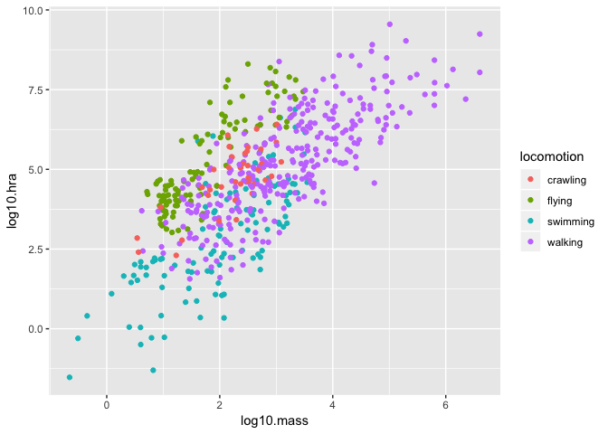<!-- -->

We can change the color of the points universally instead of using `fill`, but we need to put this into a different layer and specify the exact color. Notice the different options! Experiment by adjusting them.

#to change shape of dotes: change shape = ##. Shape = 21: circle. Shape = 22: square. Shape = 23: sideway square.

```r
homerange %>% 
  ggplot(aes(x=log10.mass, y=log10.hra))+
  geom_point(shape = 21, colour = "black", fill = "steelblue", size = 2.5, stroke = 0.5, alpha=0.75)
```

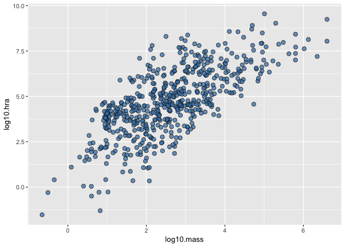<!-- -->

## Practice
1. Make a barplot that shows counts of animals by taxonomic class. Fill by thermoregulation type.

```r
homerange %>% 
  ggplot(aes(x=class, fill=thermoregulation))+
  geom_bar()
```

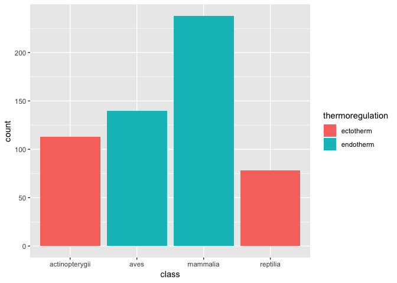<!-- -->

2. Make a box plot that shows the range of log10.mass by taxonomic class. Use `group` to cluster animals together by taxon and `fill` to color each box by taxon.

```r
homerange %>% 
  ggplot(aes(x=class, y=log10.mass, group=taxon, fill=taxon))+ #group & fill: clusters animal together by taxon. very important. 
  geom_boxplot()+
  scale_fill_brewer(palette = "BrBG")  #to apply color using a specific palette
```

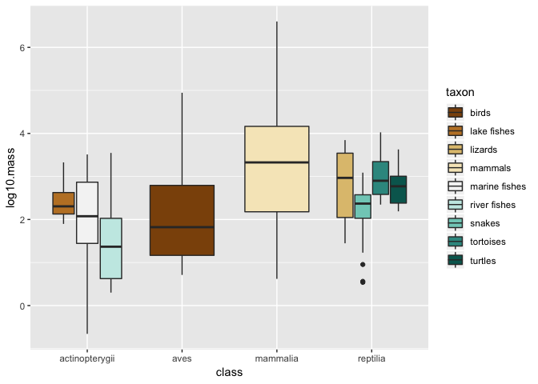<!-- -->

## Adjusting the x and y limits
There are many options for adjusting the x and y axes. For details, look over examples in the [R Cookbook](http://www.cookbook-r.com/). To adjust limits, we can use the `xlim` and `ylim` commands. When you do this, any data outside the specified ranges are not plotted.

```r
homerange %>% 
  ggplot(aes(x=log10.mass, y=log10.hra, color=locomotion))+
  geom_point()+
  xlim(0, 4)+
  ylim(1, 6)
```

```
## Warning: Removed 175 rows containing missing values (geom_point).
```

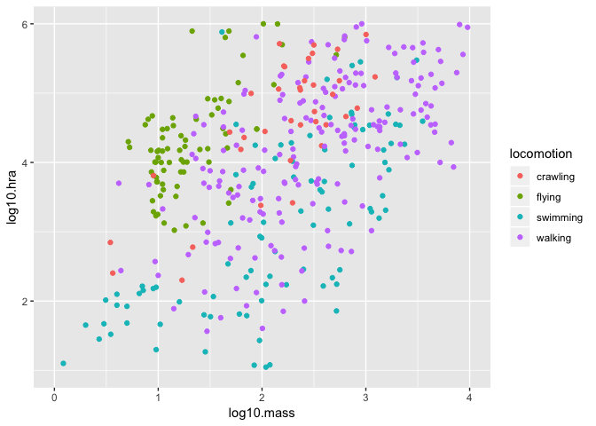<!-- -->
## Custom color palettes
It is also possible to build custom color palettes where each factor of interest is assigned a specific color. In these cases, the package `paletteer` is helpful as it is a compilation of different palettes.


```r
#install.packages("paletteer")
```


```r
library("paletteer")
```

To access the `paleteer` collection, I add it to a new object. I can then click on the object and view the palettes.


```r
colors <-
  paletteer::palettes_d_names
```

Here, I assign a palette within the paletteer package to `my_palette`. When I call `my_palette` I see the color codes; i.e., #FED439.

```r
my_palette <- 
  paletteer_d(package = "ggsci", palette = "springfield_simpsons")
my_palette
```

```
##  [1] "#FED439" "#709AE1" "#8A9197" "#D2AF81" "#FD7446" "#D5E4A2" "#197EC0"
##  [8] "#F05C3B" "#46732E" "#71D0F5" "#370335" "#075149" "#C80813" "#91331F"
## [15] "#1A9993" "#FD8CC1"
```

If I want to view the palette directly, I can build a simple barplot.

```r
barplot(rep(1,14), axes=FALSE, col=my_palette)
```

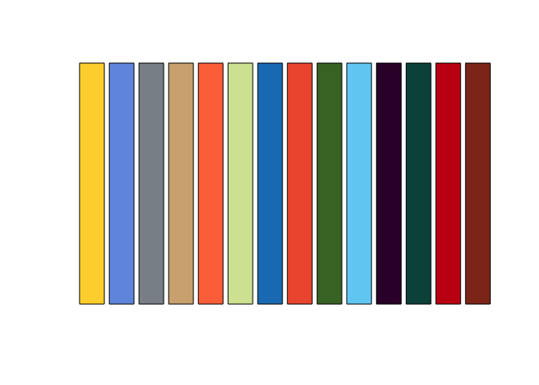<!-- -->

By using `scale_fill_manual()` we can use `my_palette` and our plot will show our custom colors.

```r
homerange %>% 
  ggplot(aes(x=trophic.guild, fill=class)) +
  geom_bar(alpha=0.9, position="dodge", color="black")+
  scale_fill_manual(values=my_palette)
```

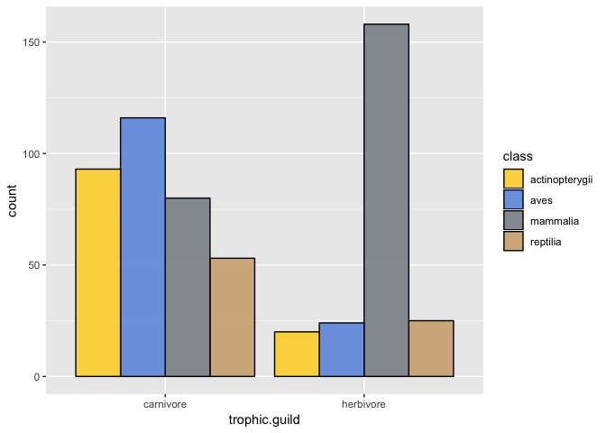<!-- -->

If we want to assign specific colors to factors, we use the color codes. The codes are assigned to a new vector.

```r
class_colors <- 
  c("#C80813", "#91331F", "#1A9993", "#FD8CC1")
```

Do you remember the names command?

```r
names(class_colors) <- 
  c("actinopterygii", "aves", "mammalia", "reptilia")
```


```r
homerange %>%
  ggplot(aes(x=trophic.guild, fill=class)) +
  geom_bar(alpha=0.75, position="dodge", color="black")+
  scale_fill_manual(values=class_colors, name="Taxonomic Class")
```

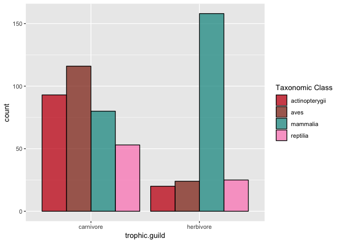<!-- -->


## Faceting: `facet_wrap()`
Faceting is one of the most amazing features of ggplot. It allows you to make multi-panel plots for easy comparison. Here, I am making histograms of log10.mass for every taxon. We read the `~` in the `facet_wrap()` layer as `by`.

```r
homerange %>% 
  ggplot(aes(x = log10.mass)) +
  geom_histogram() +
  facet_wrap(~taxon)
```

```
## `stat_bin()` using `bins = 30`. Pick better value with `binwidth`.
```

<!-- -->

## Faceting: `facet_grid()`
As you can imagine, there are lots of options for faceting. Another useful facet type is `facet_grid`. This can be helpful when you facet by only a few variables.

```r
homerange %>% 
  ggplot(aes(x = log10.mass)) +
  geom_histogram() +
  facet_grid(~thermoregulation)
```

```
## `stat_bin()` using `bins = 30`. Pick better value with `binwidth`.
```

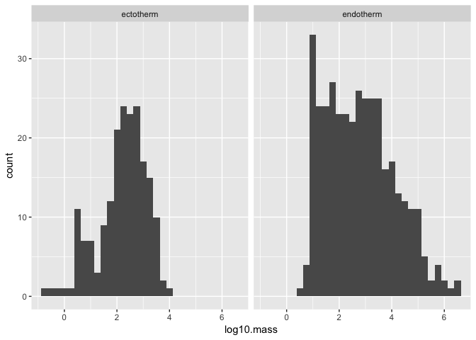<!-- -->

## Practice
1. Use faceting to produce density distributions of log10.mass by taxonomic class.

```r
homerange %>% 
  ggplot(aes(x=log10.mass))+
  geom_density(fill="steelblue", alpha=0.4)+
  facet_wrap(~class)
```

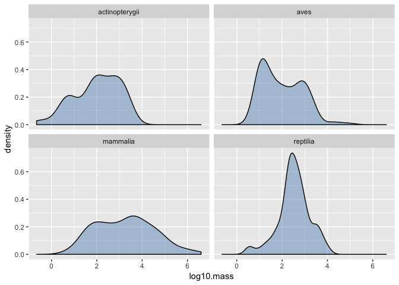<!-- -->

## RColorBrewer
The default color palettes used by ggplot are often uninspiring. They don't make plots pop out in presentations or publications, and you may want to use a customized palette to make things visually consistent.

```r
#install.packages("RColorBrewer")
library("RColorBrewer")
```

Access the help for RColor Brewer.

```r
?RColorBrewer
```

The key thing to notice is that there are three different palettes: 1) sequential, 2) diverging, and 3) qualitative. Within each of these there are several selections. You can bring up the colors by using `display.brewer.pal()`. Specify the number of colors that you want and the palette name.

```r
display.brewer.pal(8,"BrBG")
```

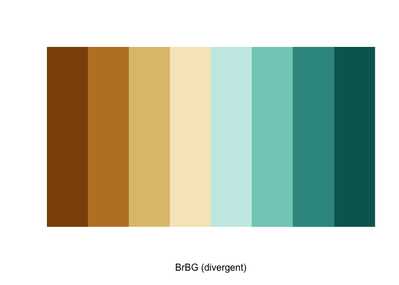<!-- -->

The [R Color Brewer](http://colorbrewer2.org/#type=sequential&scheme=BuGn&n=3) website is very helpful for getting an idea of the color palettes. To make things easy, use these two guidelines:

##
+`scale_colour_brewer()` is for points  
+`scale_fill_brewer()` is for fills  


```r
homerange %>%  
  ggplot(aes(x=log10.mass, y=log10.hra, color=locomotion))+
  geom_point(size=1.5, alpha=0.8)+
  scale_colour_brewer(palette = "BrBG")
```

<!-- -->


```r
homerange %>% 
  ggplot(aes(x=thermoregulation, fill=thermoregulation))+
  geom_bar()+
  labs(title = "Thermoregulation Counts",
       x = "Thermoregulation Type",
       y = "# Individuals")+ 
  theme(plot.title = element_text(size = rel(1.25)))+
  scale_fill_brewer(palette = "Dark2")
```

<!-- -->

## Practice
1. Build a dodged bar plot that shows the number of carnivores and herbivores filled by taxonomic class. Use a custom color theme.

```r
homerange %>%
  ggplot(aes(x=trophic.guild, fill=class)) +
  geom_bar(alpha=0.9, position="dodge")+
  scale_fill_brewer(palette = "Dark2")
```

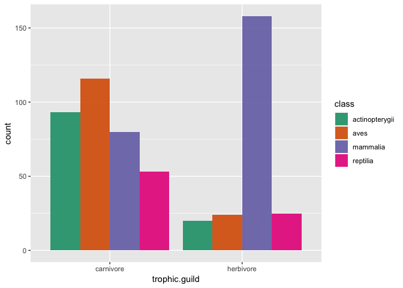<!-- -->

## Wrap-up
Please review the learning goals and be sure to use the code here as a reference when completing the homework.

-->[Home](https://jmledford3115.github.io/datascibiol/)
